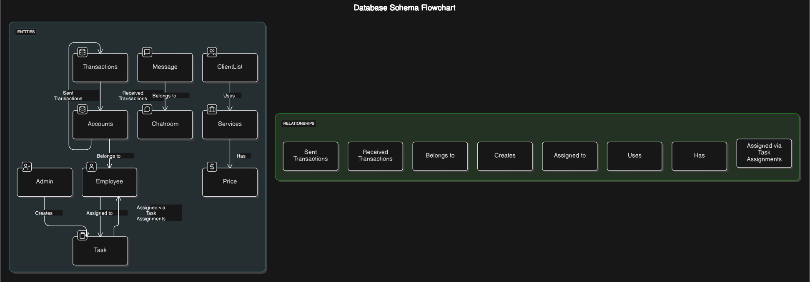
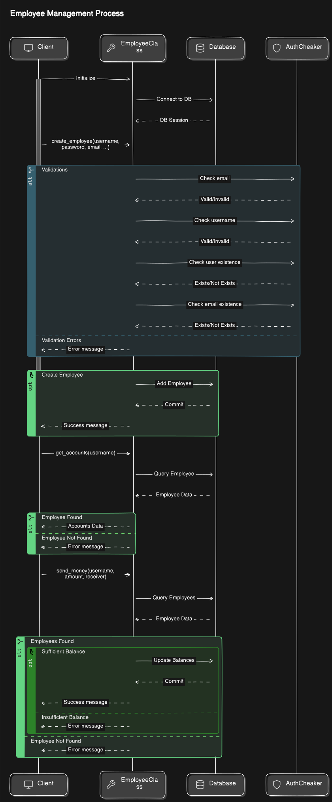
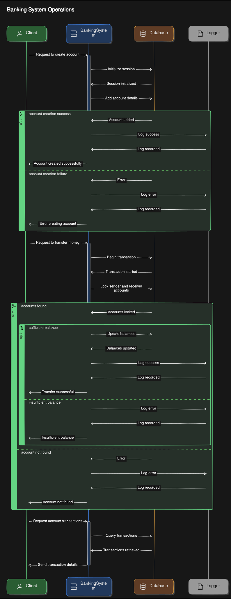
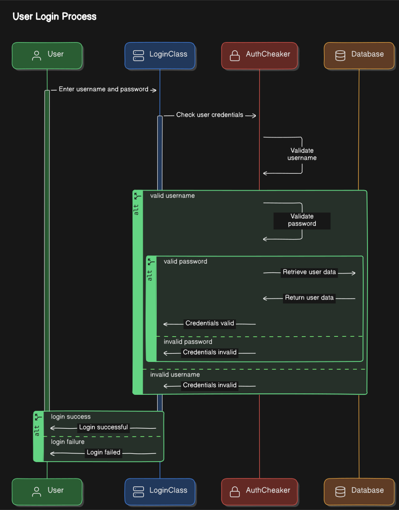
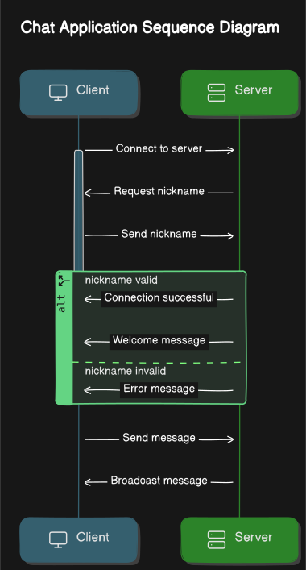
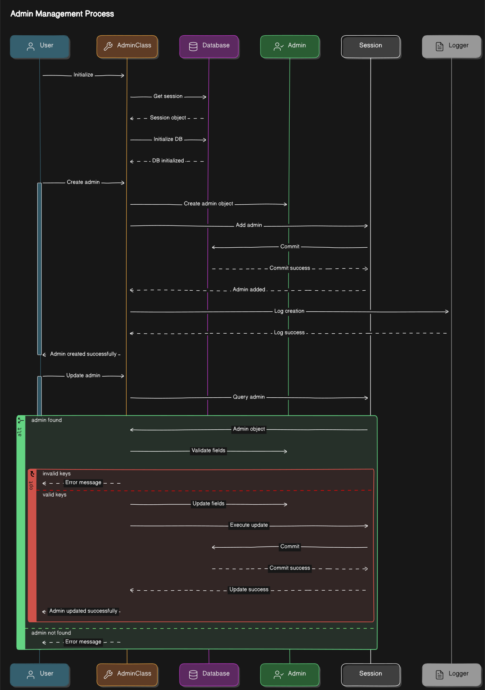

**Project: Office Automation CLI**

**Overview**

This Python-based CLI application offers comprehensive control over an office chat server and employee banking system. It provides a user-friendly interface to manage various aspects of office operations, including user accounts, messaging, and financial transactions.

**Key Features**

* **User Management:**
    - Create, modify, and delete user accounts
    - Assign roles and permissions to users
    - Manage user groups and teams
* **Chat Server Control:**
    - Start, stop, and restart the chat server
    - Monitor server status and logs
    - Send system-wide announcements
    - Configure server settings (e.g., port number, maximum users)
* **Banking System Integration:**
    - View employee balances and transaction history
    - Process salary disbursements and deductions
    - Initiate fund transfers between employees
    - Generate financial reports
* **Authentication and Authorization:**
    - Secure user authentication and authorization
    - Role-based access control to restrict user permissions
    - Encrypted communication to protect sensitive data
* **Admin Dashboard:**
    - Monitor overall system performance
    - Manage user activity and logs
    - Generate system-wide reports

**Diagrams**

**1. Name Model Diagram**



**2. Employee Management Diagram**




**3. Banking System Diagram**



**4. Auth System Diagram**



**5. Chat**



**6. Admin**



**Technical Implementation**

* **Python:** Core programming language for CLI interface and backend logic
* **Flask:** Web framework for API endpoints to interact with the chat server and banking system
* **SQLAlchemy:** ORM for database interactions (e.g., user accounts, transactions)
* **Cryptography:** Libraries for secure authentication and data encryption
* **Logging:** Framework for detailed logging of system events and errors

**Usage**

1. **Installation:**
   ```bash
   pip install office-automation-cli
   ```
2. **Running the CLI:**
   ```bash
   office-automation-cli
   ```
3. **Login:**
   Enter your username and password to access the CLI.
4. **Navigation:**
   Use the provided commands to navigate through different features and options.
5. **Operations:**
   Execute commands to manage users, control the chat server, perform banking transactions, and access the admin dashboard.

**Future Enhancements**

* **Integration with Third-Party Services:**
    - Integrate with email and calendar services for automated notifications and scheduling
    - Connect to cloud storage solutions for file sharing and backup
* **Advanced Chat Features:**
    - Implement private messaging, group chats, and file sharing
    - Add features like voice and video calls
* **Enhanced Security:**
    - Implement two-factor authentication and biometric security
    - Strengthen encryption algorithms and key management practices

By leveraging this powerful CLI tool, organizations can streamline their office operations, improve communication, and enhance financial management.
 

